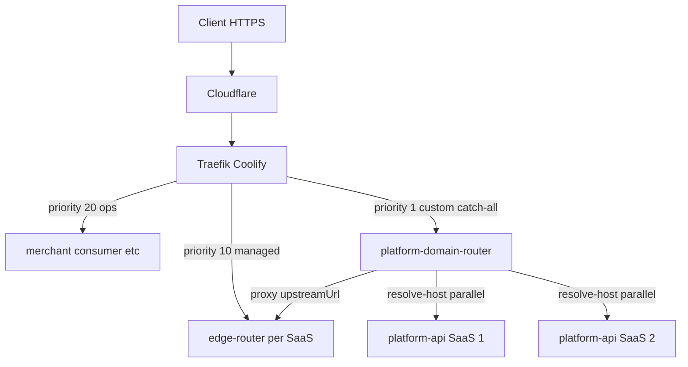

# platform-domain-router

Global **custom domain catch-all** for multi-SaaS deployments on Coolify/Traefik.

One service is the Traefik catch-all (priority 1). Managed zones and ops portals win with higher-priority routers. Remaining hostnames federate `resolve-host` across registered SaaS stacks and proxy to the winning edge-router.

## Architecture



| Traefik router                             | Priority  | Role                        |
| ------------------------------------------ | --------- | --------------------------- |
| Operational portals (`merchant-{slug}.…`)  | **20**    | Direct to portal containers |
| Managed commercial (`{slug}.izzisite.com`) | **10**    | edge-router per SaaS        |
| **platform-domain-router catch-all**       | **1**     | Custom white-label domains  |
| Coolify default 503 fallback               | **-1000** | No match                    |

Traefik picks the **highest** matching priority. The catch-all (`HostRegexp` any host, priority **1**) loses to `{slug}.izzisite.com` (10) and ops portals (20) — no host exclusions.

## Quick start (local)

```bash
npm install
export SAAS_SERVICES='[{"id":"izzipay","resolveUrl":"http://platform-api:4215/api/v1/public/sites/resolve-host","upstreamUrl":"http://edge-router:4270","priority":10,"enabled":true}]'
npm run dev
curl -s http://127.0.0.1:4280/health
```

## Configuration

| Variable                  | Default      | Description                                       |
| ------------------------- | ------------ | ------------------------------------------------- |
| `SAAS_SERVICES`           | **required** | JSON array of SaaS entries                        |
| `CACHE_TTL_MS`            | `60000`      | Positive resolve cache TTL                        |
| `NEGATIVE_CACHE_TTL_MS`   | `30000`      | Negative (404) cache TTL                          |
| `RESOLVE_TIMEOUT_MS`      | `2000`       | Per-probe timeout                                 |
| `PROXY_TIMEOUT_MS`        | `30000`      | Upstream proxy timeout                            |
| `UPSTREAM_HOST_ALLOWLIST` | —            | Optional comma-separated extra upstream hostnames |

### `SAAS_SERVICES` example

```json
[
  {
    "id": "izzipay",
    "resolveUrl": "http://platform-api:4215/api/v1/public/sites/resolve-host",
    "upstreamUrl": "http://edge-router:4270",
    "priority": 10,
    "enabled": true
  },
  {
    "id": "saas2",
    "resolveUrl": "http://saas2-platform-api:4215/api/v1/public/sites/resolve-host",
    "upstreamUrl": "http://saas2-edge-router:4280",
    "priority": 20,
    "enabled": true
  }
]
```

Each SaaS must expose `GET resolveUrl?host=` returning **200** when it owns the hostname, **404** otherwise.

## Endpoints

| Route          | Description                  |
| -------------- | ---------------------------- |
| `ALL /*`       | Catch-all proxy              |
| `GET /health`  | Liveness                     |
| `GET /ready`   | Readiness (config loaded)    |
| `GET /metrics` | Resolve/cache/proxy counters |

## Docker

```bash
docker build -t platform-domain-router .
docker run --rm -p 4280:4280 \
  -e SAAS_SERVICES='[...]' \
  platform-domain-router
```

Production image: `ghcr.io/<org>/platform-domain-router:latest`

## Coolify

See [docs/coolify.md](./docs/coolify.md). Leave **Domains UI empty** — routing is 100% via compose Traefik labels in `docker-compose.coolify.yml`.

## SaaS integration

See [docs/saas-integration.md](./docs/saas-integration.md).

## Limitations

- Single VPS: platform-domain-router is a SPOF for custom domains (managed zones unaffected).
- Cache is in-memory TTL only (60s hit / 30s miss by default).
- Do **not** run a second catch-all on individual SaaS edge-router stacks.

## License

MIT
